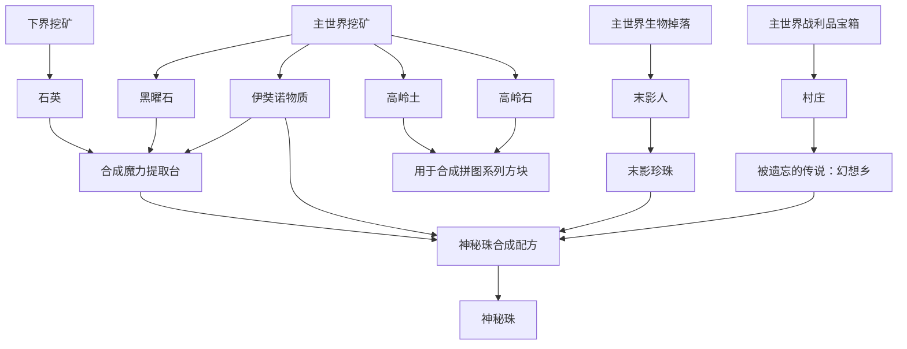
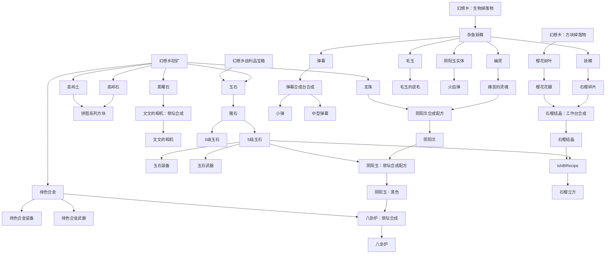
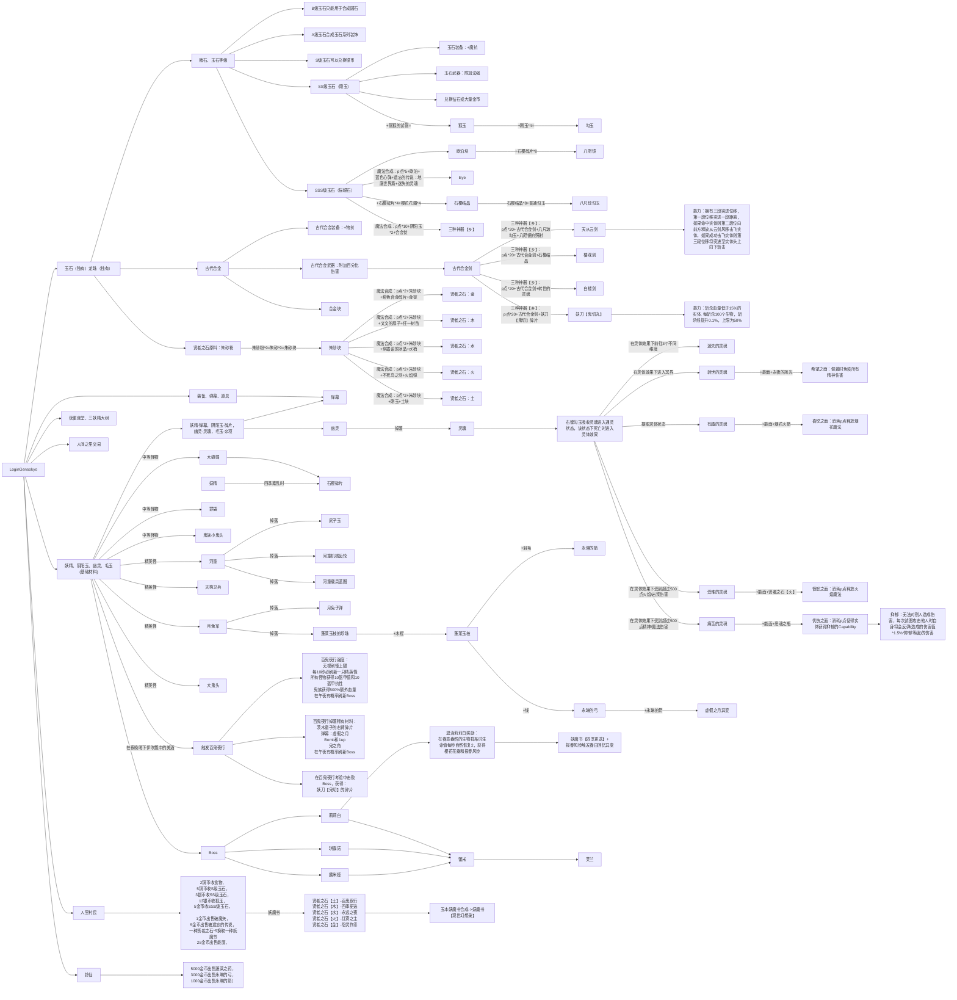

<p align="center">
    
</p>

This mod is a derivative work of Touhou Project based on Minecraft 1.16.5. There will be a lot of differences from the original work. Please take it easy. If you can accept them, then here we go.
   
## Introduction:  
  *Gensokyo, a place where mankind and youkai live within side by side keeping a dedicated balance. It is said that things
  being forgotten by the outside world will come to gensokyo, where there will be the experts to solve the big crisis called the "Incient".*  
<br>
    *幻想乡，一个人与妖怪两相对立却又彼此依存的世界。*   
    *一直以来，妖怪袭击人类，人类退治妖怪的规律维持着幻想乡微妙的平衡。据说，被外界的人们所遗忘的事物便会来到幻想乡。而一旦幻想乡出现一种名为“异变”的巨大危机时，解决异变的专家们便开始出动，寻找发动异变的元凶。*


  
This mod is an adventure mod aiming at putting the terrains of gensokyo, altogether with its unique cultural panorama, combat mechanics and structure discovery
 to Minecraft. Gensokyo Ontology(GSKO) add Gensokyo dimension with its varieties of stylistic biomes. Some biomes will generate structure
for players to discover. Players can deal with incidents, fight against with fairies and collect items in th overworld and enter gensokyo, 
try to find out the initiator of the incidents.<br><br>
本模组是一个旨在还原幻想乡场景地形、人文风貌、战斗探索与建筑结构的冒险类模组，为Minecraft添加了一个幻想乡维度及其附带的多个生物群系，并且为部分生物群系添加了
幻想乡特有的建筑结构供玩家探索冒险。玩家需要在主世界处理异变，收集材料，制作道具前往幻想乡，找出发动异变的元凶。还有更多有趣的机制和美观的装饰方块等待着大家的探索哦。

## Game Features
- A story of realities and fantasies. A discovery with immortal and immemorial beings.
- A brand-new fantasy world with immersive experience for your journey in Gensokyo.<br>
- Retreating hostile creatures to find out their stories.<br>
- Get along with all the beings in Gensokyo though it lasts short.<br>

## TODO:
Maybe we can convert svg to vertices to render 2D objects so that we can render anything we paint in PS. Like this:
```xml
<svg xmlns="http://www.w3.org/2000/svg" 
     xmlns:xlink="http://www.w3.org/1999/xlink" 
     width="1282px" height="465px">
    <path fill-rule="evenodd"  fill="rgb(0, 0, 0)" 
          d="M0.126,465.000 C17.000,245.000 397.673,0.650 642.000,-0.000 C888.492,-0.656 1282.030,246.589 1282.000,465.000 C1132.000,125.000 152.000,125.000 0.126,465.000 Z"/>
</svg>
```
If you want to parse it, use `org.w3c.dom.Document`.


## Game Process (Developing)
- 节分
- 夏越大祓祭：消除所有负面效果，净化/提升/纯化物品，多用作将初始材料进一步进行加工为中间材料
- 驱魔/祈福仪式：使用魔法、祈福、舞蹈或吟唱驱动的魔法类物品合成，多为魔法伤害
- 唐伞妖怪锻造台：强化/合成物品，多用作物理伤害

### 物品合成树（主世界部分）

### 物品合成树（玉石、石樱、绯色合金）




<br>
<br>
<br>
Original Author: ZUN/Team ShanghaiAlice
